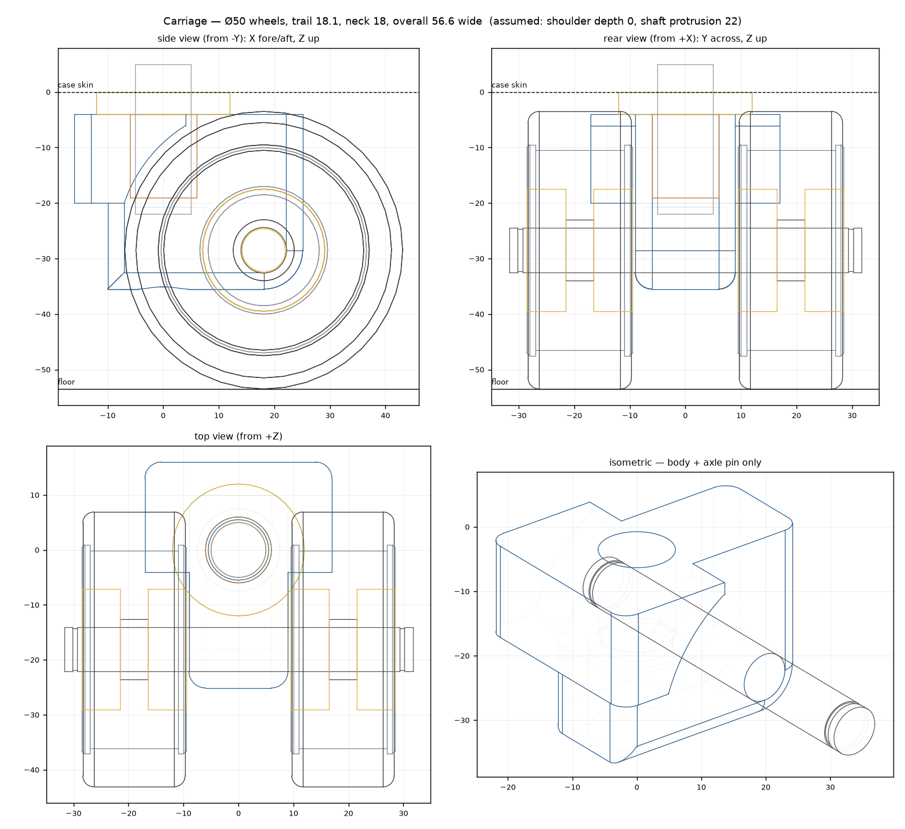

# luggage-wheel

Replacement dual-wheel spinner carriage for Rimowa-style luggage: CNC
aluminium body swivelling on the case's Ø10 shaft (needle thrust bearing +
Oilite bushing), a Ø8 through-axle, two turned aluminium hubs on twin 608
bearings, and 3D-printed TPU tires. The original wheels ran on plain plastic
bores and wore out.



- [`docs/design.md`](docs/design.md) — envelope, swivel, axle, machinist tolerances, print settings, open questions
- [`bom.md`](bom.md) — parts, quantities, sources
- [`cad/params.py`](cad/params.py) — every dimension, single source of truth
- [`cad/wheel.py`](cad/wheel.py), [`cad/carriage.py`](cad/carriage.py) — build123d models
- [`cad/generate.py`](cad/generate.py) — exports + clearance report
- [`cad/preview.py`](cad/preview.py), [`cad/views.py`](cad/views.py) — PNG renders

## Regenerate

Dependencies are managed with [uv](https://docs.astral.sh/uv/).

```sh
uv run cad/generate.py   # STEP + STL into export/, prints clearance report
uv run cad/views.py      # docs/carriage_views.png
uv run cad/preview.py    # docs/cross_section.png (wheel)
```

## Outputs

| File | Use |
|---|---|
| `export/body.step`, `hub.step`, `spacer.step`, `axle_pin.step` | to the CNC shop, with the tolerance tables in `docs/design.md` |
| `export/tire.stl` | print in TPU 95A, on its side, 100 % infill |
| `export/body_proto.stl`, `hub_proto.stl` | printed fit-check before ordering metal |
| `export/carriage_assembly.step`, `wheel_assembly.step` | full assemblies with dummy bearings, for viewing |

STL files are not committed (regenerate them); STEP files are.

## Status

Geometry is complete against the measured envelope (Ø50 × 19 wheels, 53.5 mm
case-to-floor, 18.1 trail, 19 wheel gap, Ø10 shaft). Two swivel dimensions are
still **assumed** — `SHOULDER_DEPTH` and `SHAFT_PROTRUSION` — see the open
questions in `docs/design.md`.
