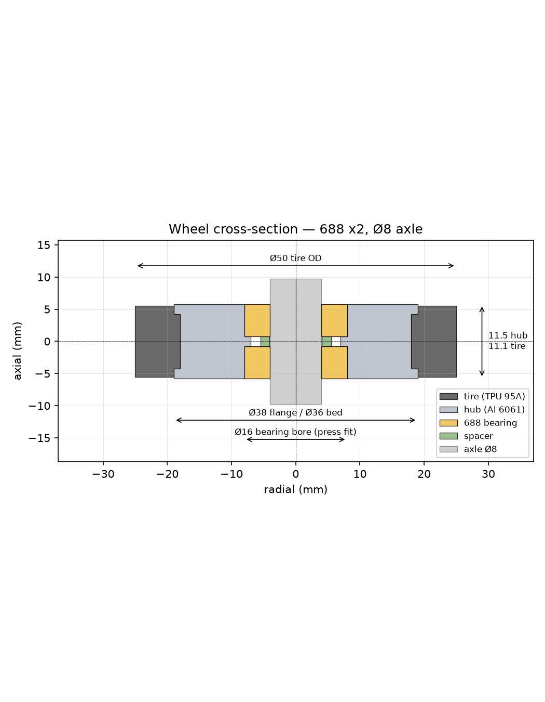

# Replacement spinner carriage — design notes

Replacement for a failed dual-wheel spinner carriage (Rimowa-style knockoff):
the whole unit that bolts onto the case's Ø10 swivel shaft and carries two
Ø50 × 11.5 mm wheels. The original's wheels ran on plain plastic bores, which
wore out.


## Architecture

| Part | Material | Made by | Qty / carriage |
|---|---|---|---|
| Body | Al 6061-T6 | outsourced CNC (3-axis milled) | 1 |
| Axle pin | Ø8 h6 ground steel shaft, 46.4 long, 2 circlip grooves | cut + grooved, or CNC order | 1 |
| Circlip | DIN 471 Ø8 | purchased | 2 |
| Hub | Al 6061-T6 | outsourced CNC (pure turned part) | 2 |
| Wheel bearing | 688-2RS (8×16×5) | purchased | 4 |
| Bearing spacer | Al or printed | same CNC order / FDM | 2 |
| Speed rings | steel 8×12×0.5 | skateboard "speed rings" | 4 |
| Tire | TPU 95A | FDM | 2 |
| Swivel thrust bearing | AXK1024 needle thrust + 2× AS1024 washers | purchased | 1 set |
| Swivel bushing | Oilite SAE 841, 10×12×15 | purchased | 1 |
| Retention washer | nylon ~6×14×1.5 | purchased | 1 |
| Retention bolt | existing M5 button head, 19 under head | reuse | 1 |

Everything is parametrised in [`cad/params.py`](../cad/params.py); regenerate
with `uv run cad/generate.py`.

## Coordinate frame

`X` fore/aft with the shaft axis at X = 0 and the wheels at X = +18.1 (trail);
`Y` across; `Z` up with **Z = 0 at the land** — the raised plastic face at the
ceiling of the corner recess that the swivel bears on. The case's bottom skin
is at Z = −22.92, flush with the shaft end; floor at Z = −53.5.

## Envelope — why the body looks the way it does

Each corner of the case has a **quarter-circle recess**, ~47.4 mm radius about
the shaft axis and 22.9 mm deep. The Ø10 shaft hangs from the recess ceiling
and ends flush with the case skin, so the whole shaft, the swivel, and the
upper 19 mm of the wheels live inside the recess; the wheels stick out ~30 mm
below the skin. Measured: land → floor 53.5, so **the wheel top is 3.5 mm
below the land** and the axle is 28.5 mm down. Consequences:

- Nothing can sit above the wheels. Everything that spans wider than the
  **16 mm neck** (wheel gap 17 − 2 × 0.5) has to be in front of the wheel
  circle or sculpted to it.
- **Swivel boss**: a Ø26 round about the shaft axis (covers the Ø24 thrust
  washer), half-round in front, tapering into the neck 3 mm behind the axis.
  It runs from the top face at Z −4 down to a **flat at Z −21.1**, which
  encloses the whole 15 mm bushing — that's where the tilting moment from the
  trailing wheels goes. Where the boss overhangs the wheels (|Y| > 8) it is
  scooped to a cylinder 1.5 mm outside the tire; those two small "ears" are
  the minimum needed to back the thrust washer.
- **Arm**: in side view, a Ø18 round about the axle joined to the boss by two
  tangent lines — one from the boss rear at Z −12 (nothing above it), one from
  the flat just behind the retention washer. Nothing sits under the bolt head.
- The whole body is inside the recess above the skin plane (max 27 mm from
  the axis; the wall is at 47).
- **Width is capped by the recess wall.** The farthest point from the swivel
  axis is the outer tread edge where the wheel crosses the skin plane; the
  original (16.63 gap, 11.5 wheels) swings at R 46.86 against a ~47.4 wall.
  We keep 11.5 mm wheels and a 17 mm gap so the swing radius is identical to
  the original's — overall width 39.6, same as stock. Going wider is not an
  option without shortening the trail.

`generate.py` prints an analytic clearance report (thrust washer ↔ tire, neck
↔ tire, wheel swing ↔ recess wall, body and bolt head ↔ floor). Check it
after every parameter change.

## Swivel

The Ø10 (measured 9.82) shaft is fixed to the case; the body rotates on it and
the case's weight bears on the Ø20.4 plastic land molded around the shaft,
with radial ribs at the same height.

**Thrust — AXK1024 needle roller thrust bearing (10×24×2) between two AS1024
hardened washers (10×24×1)**, 4 mm total, between the land and the body's top
face. The upper washer is stationary against the plastic, the lower one turns
with the body, needles between. The Ø24 washer overhangs the Ø20.4 land by
1.8 mm but sits on the ribs there, and spreads the load on the plastic far
better than the old body did.

**Radial — Oilite bronze sleeve bushing 10×12×15**, pressed into a Ø12 H7 bore
from the top, flush with the top face. A swivel turns a few degrees at near
zero speed under moderate load: that is textbook sintered-bronze territory, and
no ball bearing with a Ø10 bore fits inside an 18 mm neck anyway (6800 is
Ø19 OD). Shaft finish matters more than the bushing: if the shaft is rough or
plated-and-chipped, polish it.

**Retention** — the existing **M5 button-head bolt (Ø9.5 head, 19 mm under
head)** threads into the shaft end, and the head sits **exposed under the
boss's bottom flat**, like the original. The head is smaller than the shaft,
so a **nylon Ø14 × 1.5 washer** under it is what catches the body: it bears on
the flat, on the annulus outside the Ø10.4 shaft clearance bore. The flat is
placed at `shaft end + washer + 0.3 mm`, so under normal rolling nothing
touches; when the case is lifted the body hangs on that washer. No
counterbore, so no thin wall, and a 3 mm hex key reaches the bolt from below
between the wheels (point the key's long arm forward).

Bushing bottom (Z −19) to the flat (Z −21.1): 2 mm of solid wall, set by the
measured 22.92 mm shaft length.

## Wheel axle — single through-pin

One **Ø8 h6 ground steel pin** through the body with a **DIN 471 circlip** at
each end. Stack, from the body outward on each side:

```
body | speed ring 0.5 | hub 11.5 (2× 688 + spacer) | speed ring 0.5 | 0.3 float | circlip | 1.5 stub
```

Why not two shoulder screws: M6×Ø8 shoulder screws from opposite sides each
need ~9.5 mm of thread and would collide inside a 16 mm body. The pin has no
threads, is trapped by the wheels which are trapped by the circlips, and a
wheel comes off by popping one clip. Fix the pin in the body with Loctite 638
(or leave it floating — it cannot go anywhere). A small printed cap can hide
each circlip.

Speed rings guarantee the inner races, not the outer races or hub faces, touch
the body and the circlips.

## Body — tolerances for the machinist

| Feature | Nominal | Tolerance | Why |
|---|---|---|---|
| Bushing bore | Ø12 H7 (+0 / +0.018) | — | Oilite press fit; bushing closes ~0.02 on its ID when pressed, which is what gives the running fit on the Ø10 shaft |
| Bushing bore ⟂ to top face | — | ≤ 0.03 over 15 mm | swivel axis must be square to the thrust washer |
| Axle bore | Ø8.00 | +0.005 / +0.015 | light slip fit for an 8 h6 pin, Loctite 638 |
| Axle bore ⟂ to the Y faces of the neck | — | ≤ 0.02 | wheels must run parallel |
| Neck width | 16.0 | ±0.05 | sets wheel gap |
| Boss bottom flat | Z −21.12 from top face = 17.12 | ±0.1 | sets lift float on the retention washer |
| Shaft clearance bore | Ø10.4 | ±0.1 | must never touch the Ø9.8 shaft |
| Everything else | as STEP | ±0.1 | — |

Finish: as-machined or bead-blast + anodise. Break all edges.

# Wheel



## Why two bearings per wheel

Each wheel hangs off the side of the body on the axle pin. A single bearing
would let it rock under side load (which is what killed the plastic bore). Two
688s (8×16×5), one at each face of the 11.5 mm hub, give a 6.5 mm span between
bearing centres and turn the rocking load into a simple radial couple.
Load-wise a 688 is still heavily over-rated (Cr ≈ 1.1 kN each; a wheel sees
< 150 N). The 11.5 mm wheel width is forced by the recess (see Envelope): a
608 (7 wide) would only fit singly, and 2× 688 is the widest pair that fits
with a shoulder between them.

Use **2RS** (rubber sealed) variants — the wheel lives at ankle height in grit
and rain. Alternatives are in the `BEARINGS` table in `params.py`.

SKF abutment limits for 688: housing shoulder ≤ Ø14.6, shaft shoulder ≥ Ø9.4.
Design uses a Ø14.0 shoulder and Ø11 spacer.

## Hub — tolerances for the machinist

The hub is a lathe-only part. Callouts that matter:

| Feature | Nominal | Tolerance | Why |
|---|---|---|---|
| Bearing bore (×2) | Ø16.00 | **−0.008 / −0.016** (i.e. Ø15.984–15.992) | light press fit for a 688 (OD 16 h0/−0.008). Bearing goes in with a vise or arbor press, no retaining compound needed. |
| Bore concentricity, both ends | — | ≤ 0.02 TIR | both bearings must share an axis or the wheel binds |
| Shoulder Ø14 | Ø14.0 | ±0.1 | non-critical, just clears the seal |
| Shoulder width | 1.50 | ±0.05 | sets bearing spacing; spacer is matched |
| Hub width (face to face) | 11.50 | ±0.05 | sets the axle stack length |
| Ø38 / Ø36 | — | ±0.1 | tire is stretch-fit, forgiving |
| Chamfers | 0.5 × 45° | — | bore chamfer is the press lead-in, don't omit |

Finish: as-machined is fine. Anodise optional (looks good, no functional need).

If the shop asks for a drawing rather than "STEP + this table", the table above
is the drawing.

## Spacer

Ring Ø11 / Ø8.2 × 1.50 between the inner races — effectively a thick shim
washer. Its length must equal the shoulder width to within ±0.05 so that any
axial load goes through the two inner races and the spacer, **not** the outer
races through the shoulder. Too thin to print well; order it in aluminium with
the hubs (trivial add to the CNC order) or stack 8×11 shim washers to 1.5.

## Speed rings

8×12×0.5 steel washers on both sides of each hub. Their OD (12) touches only
the inner race (Ø8–12.1), so the body face and the circlip bear on the inner
races and never drag on the outer race or the hub face.

## Tire

- TPU 95A (e.g. NinjaFlex Cheetah, Polymaker TPU95, Overture TPU). Softer
  (85A) rolls quieter but wears faster and prints worse.
- Modelled **1.5 % undersize** on the ID so it stretches onto the Ø36 bed and
  snaps over the Ø38 flanges. It has to be stretched over a Ø38 flange to
  install (≈ 7 % strain at the lip) — trivial for TPU. Warm water helps.
- Two flanges capture it axially; friction + stretch handle torque. If it ever
  creeps, a thin smear of CA on the bed fixes it permanently.
- Print orientation: **flat on its side** (axis vertical), so layer lines run
  circumferentially — that's the quiet orientation and the strong one.
- Print settings that matter: 100 % infill (or ≥ 4 walls + gyroid ≥ 40 %),
  slow (20–30 mm/s), retraction minimal, dry filament. Tread will be slightly
  slick when new; it scuffs in.
- Minimum wall is 6 mm over the flange. Below ~4 mm TPU starts to feel like
  riding on the aluminium.

# Prototype sequence

1. ~~Measure the open questions~~ — done 2026-09-15; the first PETG body proto
   was printed against the *assumed* envelope (19 mm neck, Ø15 counterbore) and
   is superseded. Re-print.
2. Print **`carriage_fit_proto.stl`** — one piece: body, the 4 mm thrust stack
   as a solid collar, a plain Ø10.4 bore for the bare shaft, and solid wheels
   fused on. Screw it onto the case with the existing M5 bolt and a Ø14
   washer; check the recess ceiling, the 360° swing against the recess wall,
   lift retention, and that the case sits level. Wheels don't turn. Print it
   wheel-face down or upright, supports on; ream the shaft bore if tight.
   Then `body_proto.stl` (PETG, 100 % infill), `hub_proto.stl` ×2 (PLA),
   `tire.stl` ×2 (TPU) for the bearing/bushing/tire fits. FDM bores come out
   undersize — ream/scrape the Ø16 bores until a 688 pushes in by hand and the
   Ø8/Ø12 bores to a slip fit. All of this is a **fit and envelope check
   only**; a printed body will flex.
3. Buy: 4× 688-2RS, AXK1024 + 2× AS1024, Oilite 10×12×15, a length of 8 mm
   precision shaft (or an 8 mm dowel pin ≥ 50 long), 2× DIN 471 Ø8 circlips,
   speed rings, nylon ~6×14×1.5 washer.
4. Assemble on the case. Check: wheel ↔ recess ceiling, wheel swing ↔ recess
   wall through 360°, thrust washer ↔ tire, body ↔ tire, swivel free under
   load, lift retention works, case sits level.
5. Adjust → regenerate → send `body.step`, `hub.step`, `spacer.step`,
   `axle_pin.step` + the tolerance tables to a CNC shop. Order for all four
   corners if the budget allows; the other three will fail the same way.
6. Print 8 tires (~21 g TPU each), press bearings, fit tires, install.

# Open questions

Measured 2026-09-15 (all now in `params.py`):

- [x] Land → shaft end 22.92; shaft end flush with the case skin; shaft Ø9.82.
- [x] Land Ø20.39, raised, with radial ribs at the same height (backs the Ø24
      thrust washer).
- [x] Retention bolt: M5 button head, 19 under head.
- [x] Original wheels 11.5 wide, gap 16.63, ~40 overall.
- [x] Corner recess: quarter circle, wall ~42.4 from the shaft OD (R ≈ 47.4).
- [x] All four carriages eventually.

Still open:

- [ ] Recess radius was a rough caliper measurement. Confirm on the printed
      proto that the wheels swing a full 360° without touching the wall; the
      analytic margin is 0.5 mm (sharp-edged tire; the 2 mm tread fillet adds
      ~0.6 mm more).
- [ ] Is the recess wall vertical, or does it flare? (Only matters if we ever
      want wider wheels.)
- [ ] Shaft surface: plain steel? chrome? any wear from the old plastic bore?
      Oilite 10 mm ID on a 9.82 shaft is ~0.2 mm loose — acceptable for a swivel,
      but if it feels sloppy, a 3D-printed or bronze 9.9 ID sleeve is the fix.
- [ ] Bolt thread pitch: M5×0.8 assumed (standard coarse).
